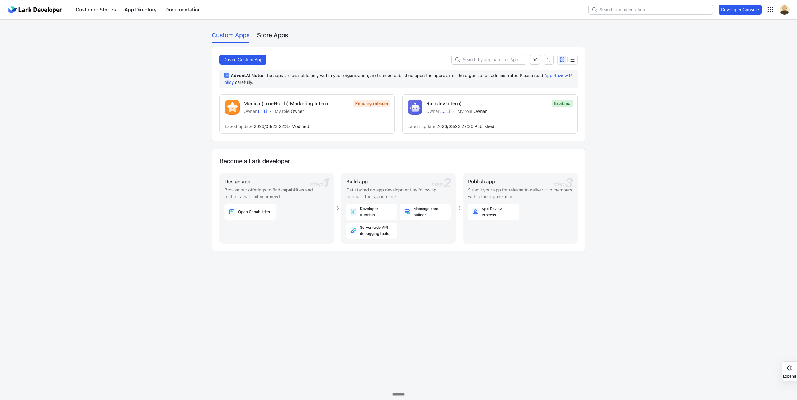
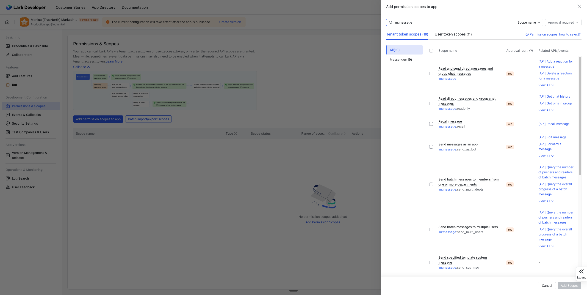
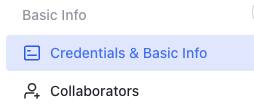
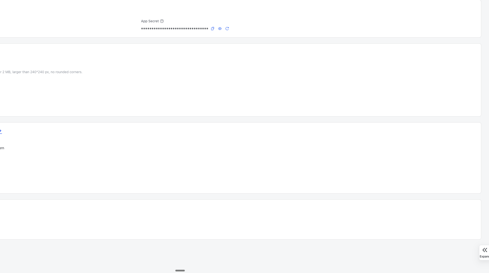
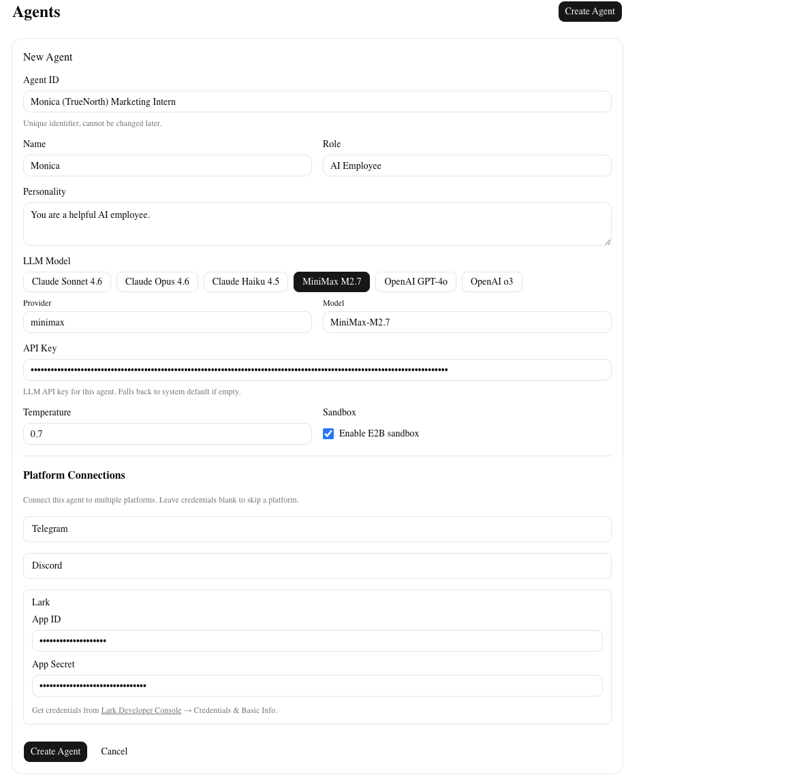

# Lark setting

## Create bot

go to https://open.larksuite.com/app
Click create custom app

## Add permission

1. 點擊 "Add permission scopes to app"（你截圖中的藍色按鈕）
2. 搜尋 im:message — 在搜尋框輸入這個關鍵字
3. 勾選以下幾個：- Receive messages sent to the bot in peer-to-peer chats (im:message.p2p_msg /im:message.p2p_msg:readonly)- Receive group chat messages mentioning the bot (im:message.group_msg /im:message.group_msg:readonly)- Send messages as bot (im:message:send_as_bot)
4. 點擊 Add Scopes 確認

## Get app_id and app_secret

go to Credential page

Copy app id and secret

paste on dashboard

Click create Agent
